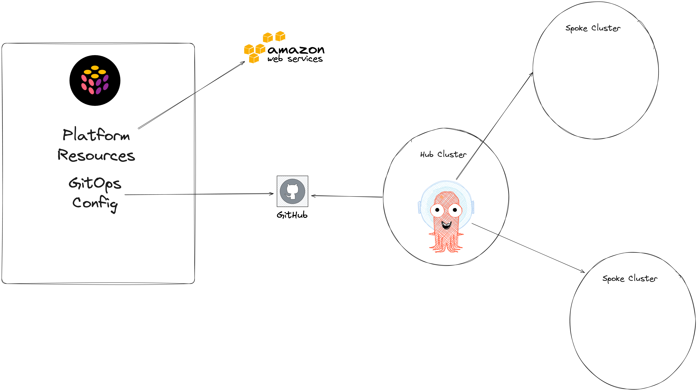

# GitOpsCon NA 2024 Demo Pulumi ArgoCD GitOps Bridge Hub-Spoke Multicluster



### References
- GitOps Bridge: https://github.com/gitops-bridge-dev
- CNCF Slack Channels: [#argocd-gitops-bridge](https://cloud-native.slack.com/archives/C06GA4TNPPH), [#cnoe-interest](https://cloud-native.slack.com/archives/C06GA4TNPPH)
- CNOE: https://cnoe.io
- Previous talks KubeCon: [Building a Bridge Between ArgoCD and Terraform](youtube.com/watch?v=ggJzfJgWO8c)


### Prerequisites
- [Get a Free Pulumi Cloud account](https://app.pulumi.com/)
- [Install pulumi CLI](https://www.pulumi.com/docs/clouds/aws/get-started/begin/#install-pulumi)
- [Install Nodejs](https://nodejs.org/en/download/)

### Setup Fork
Fork this repository and update the stacks/Pulumi.<stack>.yaml files with your own values for the following fields
- `githubOrg` This is your github org or user for your fork
- `githubRepo` This is the name of the git repo if you change the default name for the fork
- `veleroBucketPrefix` This is the unique S3 bucket name
- `hubStackName` This is the combination of pulumi account and project `pulumiaccount/projectname`


### Working Directory
```shell
cd pulumi/
```

### Install Pulumi SDK
```shell
npm install
```

### Setup Credentials
- Add an Environment Variable for `PULUMI_ACCESS_TOKEN` or use `pulumi login`
- Add an Environment Variable for `GITHUB_TOKEN` in your deployment env (local, Github Actions, AWS Code Pipeline, etc;)


### How to Start Your Hub Cluster:
1. Review `Pulumi.hub.yaml` and update configuration values as you need - You will want to update Stack Files with configuration for Github Repo/Org, as well as AWS Account ID, CIDRs, etc;
1. Add any extra resources you may need in your given environment
1. Run Pulumi Up for the Hub Cluster's Stack `pulumi up --stack hub`
1. Wait for the Resources to create like VPC, EKS Cluster, and IAM permissions
1. Set environment variable `ARGO_IAM_ROLE_ARN` before running next step `export ARGO_IAM_ROLE_ARN=$(pulumi stack output -s hub -j | jq .outputs.argoRoleArn -r)`
1. Run `./bootstrap.sh` to install ArgoCD on Hub cluster
1. Run `git pull` to fetch the file `gitops/clusters/hub-cluster.yaml`
1. Setup kubectl cli `aws eks --region us-east-1 update-kubeconfig --name hub-cluster --alias hub-cluster`
1. Run `kubectl create -f ../gitops/clusters/hub-cluster.yaml`
1. Access ArgoCD UI:
    ```shell
    echo "Username: admin"
    echo "Password: $(kubectl -n argocd get secret argocd-initial-admin-secret -o jsonpath="{.data.password}" --context hub-cluster | base64 -d)"
    echo "Access https://localhost:8080"
    kubectl -n argocd port-forward svc/argocd-server 8080:443 --context hub-cluster
    ```

### How to Add Spoke Clusters:
1. Review `Pulumi.dev.yaml` and add any extra resources you may need in your given environment
1. Run Pulumi Up for the Spoke Cluster's Stack `pulumi up --stack dev`
1. Wait for the Resources to create like VPC, EKS Cluster, and IAM permissions
1. Apply the Secret resource that was added to the GitOps Repository
1. Setup kubectl cli `aws eks --region us-east-1 update-kubeconfig --name dev-cluster --alias dev-cluster`
1. Repeat same steps for the next cluster like `prod` `pulumi up --stack prod`

### Destory Clusters
```shell
pulumi destroy --stack dev
pulumi destroy --stack prod
pulumi destroy --stack hub
```

### Productionizing your Implementation

* Add Authentication for ArgoCD to be able to grab from your Organization's private repository
* Add ApplicationSets to your configuration by looking at the GitOps Bridge Control Plane Template for resources you need
* Create an ArgoCD Application that manages deployment of your Cluster Secret
* Move your EKS Cluster to be a private access endpoint

### File Structure
```
root/
  .github/ # Contains Github Actions to deploy and preview Pulumi IaC
  gitops/ # Contains Gitops Configuration
    addons/ # Contains the Application Set Files and Addons we want
      platform/ # Contains the platform level addons we want
      team/ # Contains the Application Team addons we want
    bootstrap/ # Contains the bootstrap application to deploy cluster secrets and applicationsets
    charts/ # Contains Helm Charts and default values for configuration
      platform/ # Contains Platform Helm Charts and default values
      team/ # Contains Application Team Helm Charts and default values
    clusters/ # Contains the cluster secret files
    overrides/ # Contains Values file overrides
      clusters/ # Contains Values file overrides for specific cluster
      environments/ # Contains Values file overrides for specific cluster environments
  pulumi/ # Contains the Pulumi code for the repository
    bootstrap.sh # The bootstrap command to run to setup the hub cluster
    Pulumi.hub.yaml # Contains configuration for the Pulumi Stack "hub"
    Pulumi.dev.yaml # Contains configuration for the Pulumi Stack "dev"
```